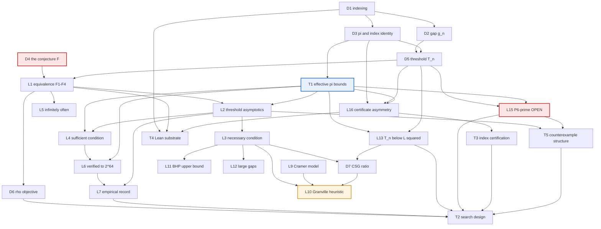

# Firoozbakht's Conjecture — CONCEPT CARDS

**Molecule:** `task-20260725-068e` (leg: `concept-cards`, crew role: concept-writer)
**Run:** `germ-20260725-791a7c45` · **Date:** 2026-07-25
**Target:** `p_{n+1}^{1/(n+1)} < p_n^{1/n}` for all `n ≥ 1` — equivalently, `(p_n)^{1/n}` is
strictly decreasing. **Status: OPEN.** Neither assumed true nor assumed false.

**30 cards** — 7 definitions, 18 lemmas/theorems, 5 techniques.
Every card carries an explicit verdict (**PROVEN / OPEN / HEURISTIC / MIXED**), the source-ledger
row it rests on with a tier, its place in the proof-obligation tree, its dependencies, and a
declared gap.

---

## 0. Perimeter (v5.1 clause)

**Admitted inputs — exhaustively:**

| Input | Provenance |
|---|---|
| `source-ledger.md` (20 rows) | leg `source-ledger`, molecule `task-20260725-d320`, this run |
| `decompose.md` (636 lines) | leg `decompose`, molecule `task-20260725-c062`, this run |
| `frame-deliberation/{frame,synthesis,outcomes}.md` + 5 persona responses | leg `frame-deliberation`, molecule `delib-20260725-07fc`, this run |
| in-run computation performed **by this leg** | sieve to `3·10⁶`, reported in §3 below |

**Nothing else.** No file was consulted because it happened to sit in the working tree. Every
mathematical claim on every card traces to (i) a **source-ledger row** with a locator and a tier,
(ii) an **upstream artifact** of this run, explicitly named, or (iii) a **derivation carried out
in this leg**, marked as such and re-verified numerically where numerical.

**Tier vocabulary is inherited from `source-ledger.md` §1** — `L0` (primary source fetched,
statement read at the locator), `L1` (fetched, locator not independently confirmable), `L2_strong`
(two independent L0 attestations), `L2_weak` (one), `L3` (recall — **no card rests on an L3 row;
the ledger contains none**).

**A card that rests on nothing citable says so** in its *Declared gap* section rather than
borrowing authority. Six cards do: **L5** (Zhang unsourced), **L11** (the RH-conditional gap bound
unsourced), **L16** (logic folklore, no row), **L18** (Littlewood unsourced), **T3** (prime-count
complexity unsourced), **T5** (Jacobsthal unsourced).

---

## 1. The card set

### Definitions

| Card | Title | Verdict | Rests on (tier) |
|---|---|---|---|
| [**D1**](D1-prime-indexing.md) | Prime sequence and indexing convention | PROVEN | `mathlib_nat_prime_nth` (L0) |
| [**D2**](D2-gap-and-log.md) | Prime gap `g_n`, logarithm `L_n` | PROVEN | `kourbatov2015bounds` (L0) |
| [**D3**](D3-pi-and-count-index-identity.md) | `π(x)` and the identity `π(p_n) = n` | PROVEN | `kourbatov2015verification` (L0) §3 eq. (5) |
| [**D4**](D4-the-conjecture.md) | The conjecture `F`, four equivalent forms | **OPEN** (the target) | 5 independent L0 statements |
| [**D5**](D5-threshold-Tn.md) | The threshold `T_n = p_n(p_n^{1/n} − 1)` | PROVEN | `visser2019verifying` (L0) Conj. 3 |
| [**D6**](D6-rho-normalized-objective.md) | `ρ_n = g_n/T_n` — the correct search objective | PROVEN | **D5** + **L1** |
| [**D7**](D7-csg-ratio.md) | `c_n = g_n/log²p_n` — the Cramér–Shanks–Granville ratio | PROVEN | `oeis_A111943` (L0) |

### Lemmas and theorems

| Card | Title | Verdict | Rests on (tier) |
|---|---|---|---|
| [**L1**](L1-equivalence-of-forms.md) | Equivalence of F1–F4 | PROVEN | in-run + `kourbatov2015bounds` (L0), `visser2019verifying` (L0) |
| [**L2**](L2-threshold-asymptotics.md) | `T_n = L² − L − 1 + o(1)`, effective | PROVEN | `kourbatov2015bounds` (L0) Thm 5 → `axler2014newbounds` (**L2_strong, unopened**) |
| [**L3**](L3-necessary-condition.md) | `F ⟹ g_k < L² − L − 1` (`k > 9`) | PROVEN | `kourbatov2015bounds` (L0) Thm 1; `ferreira2017consequences` (L0) Thm 2.2 |
| [**L4**](L4-sufficient-condition.md) | `g_k < L² − L − 1.17` (`k > 9`) `⟹ F` | PROVEN | `kourbatov2015bounds` (L0) Thm 3 |
| [**L5**](L5-infinitely-often.md) | `F` holds for infinitely many `n`, **unconditionally** | PROVEN | `ferreira2017consequences` (L0) Thm 5.2 |
| [**L6**](L6-verified-range.md) | `F` verified for all `p < 2⁶⁴` | PROVEN (computationally) | `kourbatov2015verification` (L0) endnote; `visser2019verifying` (L0) |
| [**L7**](L7-empirical-record.md) | Record `c = 0.92064` / `ρ = 0.94846`; ~5.2 % margin | PROVEN | `oeis_A111943` (L0) + Nicely (L0) |
| [**L8**](L8-implication-chain.md) | Farhadian ⟹ Nicholson ⟹ Firoozbakht ⟹ Forgues | PROVEN | `ferreira2017consequences` (L0) Thm 4.5; `visser2019verifying` (L0) |
| [**L9**](L9-cramer-model.md) | Cramér: `limsup = 1` **for the model**, suggested for primes | PROVEN (about the model) | `cramer1936order` (L0) pp. 24, 27 |
| [**L10**](L10-granville-heuristic.md) | Granville: `limsup ⪆ 2e^{−γ} ≈ 1.12292` — the tension | **HEURISTIC** | `granville1995cramer` (**L1**, preprint pagination) |
| [**L11**](L11-bhp-upper-bound.md) | `g_n ≪ p_n^{0.525}` — the proof-side obstruction | PROVEN | `baker2001difference` (L1, abstract only) |
| [**L12**](L12-fgkmt-large-gaps.md) | Large-gap lower bound — the refutation-side obstruction | PROVEN | `ford2016large` (L1, abstract only) |
| [**L13**](L13-Tn-below-Lsquared.md) | `T_n < L_n²` except `n ∈ {1..7, 10}` | PROVEN (in-run + L0 input) | `dusart2010estimates` (L0) Thm 6.9 |
| [**L14**](L14-smooth-model.md) | The smooth model is monotone on `[5,∞)` | PROVEN (and over-billed) | in-run |
| [**L15**](L15-maximal-gap-reduction.md) | **P6′ — the maximal-gap reduction** | ⚠️ **OPEN** | no row asserts it |
| [**L16**](L16-certificate-asymmetry.md) | Σ₁/Π₁ asymmetry; refutation certificates are not short | PROVEN | self-contained (**no row**) |
| [**L17**](L17-anti-lemma-bertrand.md) | *Anti-lemma:* Bertrand is useless here | PROVEN | in-run |
| [**L18**](L18-anti-lemma-littlewood.md) | *Anti-lemma:* Littlewood oscillation does not shift `T_n` | PROVEN (narrower than usually stated) | in-run (**no row for Littlewood**) |

### Techniques

| Card | Title | Verdict | Rests on (tier) |
|---|---|---|---|
| [**T1**](T1-effective-pi-bounds.md) | Effective `π(x)` and `p_k` bounds | PROVEN | `dusart2010estimates` (L0); `axler2014newbounds` (**unopened**) |
| [**T2**](T2-search-design-and-precision.md) | Search design and numerical precision | PROVEN where it claims | **D6**, **L6**, **L7**, **L13** |
| [**T3**](T3-index-certification.md) | Certifying the index of a candidate | PROVEN (direction argument) | **L16**, **T1** |
| [**T4**](T4-lean-substrate.md) | Lean 4 / Mathlib substrate | PROVEN on the two hard facts | `mathlib_nat_nth`, `mathlib_nat_prime_nth` (L0) |
| [**T5**](T5-counterexample-structure.md) | Constrain a counterexample before hunting it | **MIXED** — (a),(b) proven; (c) unsourced; (d) open | `ferreira2017consequences` (L0) Lem. 3.2 |

---

## 2. Dependency graph

Only the load-bearing spine is drawn. **L8** (the strengthening chain) and **L17** (the Bertrand
anti-lemma) have no consumers by design and are omitted; **L14** and **L18** appear on their own
cards with their (absent or fragmentary) edges discussed there.

**Two things this graph shows that the upstream tree did not:**

1. **`T1` is a hub, not a leaf.** It is consumed by **L2, L3, L4, L6, L13, L15, L16** — i.e. by
   both branches and by a falsifiability test. `decompose` §2 placed effectivity as a leaf on the
   proof branch alone.
2. **`L15` sits under the only live route.** Everything **T2** does that is cheap flows through an
   **open** lemma.

---

## 3. In-run verification performed by this leg

Every number quoted on a card was recomputed here rather than copied. Sieve of Eratosthenes to
`3·10⁶` (216 816 primes, largest `2 999 999`), 1-indexed.

| Quantity | Result | Card |
|---|---|---|
| Violations of `F`, `1 ≤ n ≤ 216 815` | **none** | **D6** |
| `max ρ_n` (`n ≥ 10`) | `0.7604709` at `n = 217`, `p = 1327`, `g = 34` | **D6**, **T2** |
| runner-up `ρ_n` | `0.7590821` at `n = 149 689`, `p = 2 010 733`, `g = 148` | **D6** |
| `max c_n` (`n ≥ 10`) | `0.7025656` at `n = 149 689`, `p = 2 010 733` | **D7**, **T2** |
| Steps with `T_{n+1} < T_n` (`n ≥ 10`) | **121 238 / 216 806 = 55.9200 %** *(denominator corrected 2026-07-27, round-3 reconciliation, decision 4 — see `attack/reconciliation.md` §4; all-`n` form is `121 239 / 216 815 = 55.9182 %`)* | **D5**, **L15** |
| Record (maximal) gaps in range | **21** | **L15** |
| `T_{m(n)} ≤ T_n`, `m(n)` = governing record index | **0 exceptions in 216 815 pairs** | **L15** |
| `{n : T_n ≥ L_n²}` | exactly **`{1,2,3,4,5,6,7,10}`**; `p_109 = 599` | **L13**, **D7** |
| Smooth-model bracket sign change | **`x = 4.015067`** (so `x ≥ 5` safe, `x ≥ 4` false) | **L14** |
| `T_n` vs `L²−L−1` vs `L²−L−1−3/L` at `n = 10⁴, 10⁵, 216 815` | see **L2** table — the `−3/L` refinement is **not confirmed** by in-range data | **L2** |
| `T_n/(L²−L−1) − 1` at `p = 113 / 1327 / 2 010 733 / 2 999 957` | `+16.03 % / +2.744 % / −0.0872 % / −0.0730 %` | **D5** |
| Threshold misclassification for the `T`-increase rule | `L`: 7.075 %; `L−1`: 2.794 %; **`L−2`: 0.295 %**; `L−3`: 7.188 % | **D5** |
| Record-prime conversions (`p = 1693182318746371`, `g = 1132`, `L = 35.065386`) | `c = 0.92063859`, `ρ = 0.94845823`, ceiling `1−1/L = 0.97148185`, margins `5.234 %` / `5.154 %` | **L7**, **D7** |

**Scale disclaimer, stated because it is easy to lose:** `3·10⁶` is **≈12.79 orders of magnitude**
below the published frontier of `2⁶⁴` (**L6**). This is a sanity probe. **It must never be cited
as a verification.**

---

## 4. Corrections these cards carry forward

Consolidated so no downstream leg has to reconstruct them. Each is traced to where it was found.

| # | Correction | Card | Found by |
|---|---|---|---|
| 1 | **Mathlib is 0-indexed; the run is 1-indexed.** The proposed Lean statement formalizes a *strictly weaker* conjecture and drops `m = 1`. Highest severity in the run. | **D1**, **T4** | `synthesis.md` C1 (godel, knuth); `source-ledger.md` §4.8 |
| 2 | **The verified frontier is `2⁶⁴`, not `4·10¹⁸`.** | **L6** | `source-ledger.md` §4.1 |
| 3 | **"Claim A" is Kourbatov's Theorem 5 (2015), published with an effective error term.** The declared gap "not made effective" was already closed in the literature. | **L2** | `source-ledger.md` §4.3 |
| 4 | **Converse-direction criteria exist and are explicit** (Kourbatov Thm 3, `b = 1.17`). The upstream "do not build on until sourced" hole is closed. | **L4** | `source-ledger.md` §4.4 |
| 5 | **An unconditional theorem the decomposition did not have:** `F` holds infinitely often. | **L5** | `source-ledger.md` §4.5 |
| 6 | **Cramér proved `limsup = 1` about his model and *suggested* it for the primes.** | **L9** | `source-ledger.md` §4.6 |
| 7 | **`Nat.nth` is `noncomputable`, not merely slow** — which changes the fix, not just its wording. | **T4** | `source-ledger.md` §4.7; `synthesis.md` §4.5 |
| 8 | **"Proving `F` is strictly harder than RH" is an overreach.** The *strength* comparison is right; the *difficulty ordering* does not exist. | **L11** | `synthesis.md` C3 (5/5) |
| 9 | **"L4 is the only genuine theorem" is false and inverts the Lean priorities.** The smooth model contains no primes and has no consumer. | **L14**, **T4** | `synthesis.md` C4 (5/5) |
| 10 | **The `T_n < L_n²` exception set is `{1..7, 10}`, not `n ≤ 10`** — `n = 8, 9` pass, `n = 10` fails. Not a monotone crossing. | **L13** | `synthesis.md` C5 (4/5) |
| 11 | **P6′ is over-alarmed and the evidence offered for it is non-diagnostic** — the "six tightest cases are records" finding is a `[:6]` print truncation and is structurally necessary anyway. The evidence that *does* bear on P6′ shows zero exceptions. | **L15** | `synthesis.md` C7 (4/5), §4.4 |
| 12 | **The refutation certificate must certify the *rank*, not just the primes.** "Finitely certifiable" ≠ "short certificate". | **L16**, **T3** | `synthesis.md` C2 (3/5) |
| 13 | **The FGKMT exponent is `(logloglog X)²`,** and the *Annals* 2016 paper has **four** authors, not five. | **L12** | `source-ledger.md` §4.2; this leg |
| 14 | **Construction is blocked by magnitude only** — the localization objection is dissolved by the run's own Littlewood anti-test. | **L12**, **L18** | `synthesis.md` C11 (3/5) |
| 15 | **Unit collision `ρ` vs `c`.** In `ρ` units the all-primes record is `0.94846`, not `0.92`. | **D7**, **L7**, **T5** | `synthesis.md` C13 |
| 16 | **The `T`-increase threshold is `L−2`, not `L`** — and the derivation cannot resolve it anyway (`n ≈ p/L` carries `1/L ≈ 7 %` error). Drop the smooth derivation; cite the discrete measurement. | **D5** | `synthesis.md` D2 |
| 17 | **The 5 % margin is anchor-limited, not analysis-limited** — asymptotic slack is ~750× smaller. | **L2**, **L7** | `synthesis.md` D1 |
| 18 | **A pruned null result establishes "`F` holds at record indices", not `F`.** | **L15**, **T2** | `synthesis.md` C6 (4/5) |
| 19 | **The Littlewood anti-test's heading over-scopes:** it bounds the effect on the right-hand side only; prime-deficit/large-gap correlation is untouched. | **L18** | `synthesis.md` C12 |
| 20 | **Doubles die at `p ≈ 2·10¹⁵`, below the frontier**, and the F2-margin statistic is a `1/n` artifact. | **T2**, **D6** | `synthesis.md` C10 (4/5), D5 |

---

## 5. The open obligations, ranked by tractability

| Rank | Obligation | Card | Why here |
|---|---|---|---|
| 1 | **Discharge P6′.** Bound `T`'s oscillation below its coarse trend with Dusart's effective bounds; compare against record-gap spacing. | **L15** | The only open node with a visible route. Empirically unviolated (0/216 815). Wheeler's assessment — "a Dusart lookup, not a research leg" — is plausible and untested. |
| 2 | **Open Axler.** Corollaries 3.5/3.6 sit beneath **L2**, **L3** and **L4**; unopened; one range already moved nine orders of magnitude by corrigendum. | **T1** | Citation-gate Priority 1. Cheap. Three load-bearing cards depend on it. |
| 3 | **Fix the index in the Lean statement file, once.** | **D1**, **T4** | Highest severity, lowest cost. Everything downstream imports it. |
| 4 | **Re-locate Granville against the journal copy** (preprint pp. 1–16 vs journal pp. 12–28). | **L10** | Citation-gate Priority 2. The content is confirmed; only pagination is not. |
| 5 | **Source the six unsourced claims.** Zhang; the RH-conditional gap bound; Littlewood; prime-counting complexity; Jacobsthal; the Π₁-independence remark. | **L5**, **L11**, **L18**, **T3**, **T5**, **L16** | Each is standard and undisputed; none is sourced in this run. |
| 6 | **Confirm the Kourbatov bracket's locator** (`−3.83/L`: Theorem 4 hypothesis or Theorem 5 error term?). | **L2** | A locator-precision item that would otherwise ship into the paper. |
| 7 | **Settle strict vs non-strict for Nicholson and Farhadian.** | **L8** | Unexamined in this run. Cheap; matters only if the chain is formalized. |

---

## 6. Standing instruction

The conjecture is **OPEN**.

- Do **not** write "Firoozbakht is true." No proof exists, and **L11** shows none is near.
- Do **not** write "Firoozbakht is false." **L10** is a heuristic, and no finite computation bears
  on a `limsup`.
- The defensible sentence, and the one these cards are built to support:

> *Firoozbakht's conjecture is verified for all primes below `2⁶⁴`, is known unconditionally to
> hold for infinitely many `n`, and is simultaneously incompatible with the corrected
> Cramér–Granville heuristic. At least one of the two must fail, and no current technique can say
> which.*

Every claim in the final paper must name a **card**, and through it a **citekey and locator** from
`source-ledger.md` §2. A claim that cannot is a gap, and must be written as one.
